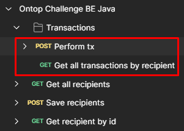

# Ontop Challenge Backend API

This guide provides step-by-step instructions for **locally** setting up, configuring, and running
the Ontop Challenge Backend API using IntelliJ IDEA, Maven, Spring Boot, and an embedded H2 database.

## Table of contents
[Prerequisites](#prerequisites)

[Getting Started](#getting-started)

1. [Clone the Repository](#1-clone-the-repository)
2. [Configure Application Properties](#2-configure-application-properties)
3. [Create Data SQL File](#3-create-data-sql-file)
4. [Run the Application](#4-run-the-application)
   - [Testing the app](#testing-the-app)
5. [Deploy it to a Docker container](#5-deploy-it-to-a-docker-container)
   - [Using the IDE](#using-the-ide)
   - [AWS container services](#aws-container-services)
6. [Try it with Postman](#6-try-it-with-postman)
   - [Perform transaction](#perform-transaction)
   - [Get all transactions by recipient (ordered and filtered)](#get-all-transactions-by-recipient-ordered-and-filtered)
   - [Get all recipients](#get-all-recipients)
   - [Save recipients](#save-recipients)
   - [Get recipìent by id](#get-recipient-by-id)

## Prerequisites

Before you begin, ensure you have the following installed:

- [JDK 17](https://www.oracle.com/java/technologies/javase-jdk17-downloads.html): Make sure JDK 17
  is installed on your system.
- [Maven 3.9.x](https://maven.apache.org/install.html): You can follow
  the [installation instructions](https://maven.apache.org/install.html) for your operating system.
- [IntelliJ IDEA](https://www.jetbrains.com/idea/download/): Install IntelliJ IDEA, IDE recommended. Or another you feel most comfortable.
- [Docker](https://www.docker.com/products/docker-desktop/): if you want to place the app inside a Docker container.

To deploy in AWS Cloud using CI/CD, you'll need accounts in:
- [Docker Hub](https://hub.docker.com/): To upload images.
- [GitHub](https://github.com/): To upload the code on repos and use later
[GitHub Actions](https://github.com/features/actions) to CI/CD. 
- [AWS Cloud](https://aws.amazon.com/): To make use of [AWS ECS](https://aws.amazon.com/ecs/) 
& [AWS Fargate](https://aws.amazon.com/es/fargate/). We'll use these services to manage containers and deploy the images.

## Getting Started

Follow these steps to set up and run the Ontop Challenge Backend:

### 1. Clone the Repository

Clone the Ontop Challenge Backend API repository to your local machine:

```bash
git clone git@github.com:yvan-lopez-it/ontop-challenge-bese-java.git
```

### 2. Configure Application Properties

* Open the application.properties file located in the `src/main/resources` directory of your
  project.
* Modify the properties in the file as needed. For example, set the database URL
  to `jdbc:h2:mem:testdb`, and configure other properties.

### 3. Create Data SQL File

* Create a `data.sql` file in the `src/main/resources` directory if it doesn't exist.
* Populate the `data.sql` file with the SQL statements needed for initializing your database with
  sample data.
* The file has been preloaded with just 1 `recipient` and 8 `transactions`.
* When the app is up and running you can access to http://localhost:8080/h2-console.
* Then, to login, you can use the credentials described in `application.properties`:

```bash
username: sa
password: password
```

### 4. Run the Application

* In Intellij IDE you can Right-click on the `BackendApiRestApplication.java` file.
* Select `Run BackendApiRestApplication` to build and run your Spring Boot application.

Another way is:

* Open a terminal or command prompt.
* Navigate to your project's root directory.
* Execute the following Maven command to build and run your Spring Boot application:
  ```bash 
  mvn clean install  
  ```
  Then
  ```bash  
  mvn spring-boot:run
  ```
* `mvn clean install`: This command cleans the project, compiles the code, runs tests, and packages
  your application into a JAR file.
* `spring-boot:run`: This goal starts your Spring Boot application.

### Testing the app

You can run unit tests and integration tests for your application components using the following
Maven command:

  ```bash  
  mvn test
 ```

* This command runs tests using JUnit and Mockito, which are commonly used testing frameworks in
  Java.

### 5. Deploy it to a Docker container
To achieve deployment to a Docker container, we need to run the Dockerfile. Follow these steps:

* Make sure Docker is running.
* Open a terminal and go to the project root.
* Package the app with Maven:
```bash
mvn package
```
* Build the image by running this command:
```bash
docker build -t ontop-challenge-be:1.0.0 .
```
_(actually, you can write any `{description_name}:{x.y.z}` version)_
* Now, run this command to see the images list:
```bash
docker image
```
* Looking for the repository named `ontop-challenge-be` and copy the image ID associated
* Build the container from the image:
```bash
docker run -p 8080:8080 {image ID associated}
```
* You will see the container created and the app running.
```bash
docker run -d ontop-challenge
```

* If in some point you want to create and upload an image to a container, you can go with this:
```bash
mvn spring-boot:built-image
``` 
* It uses Maven to build your Spring Boot application, just like running `mvn clean install` 
or `mvn package`. As we've seen above.

* After the build is complete, it uses the Spring Boot Maven Plugin to create a Docker image 
of your application. 
This means it generates a Docker image containing your application's JAR file and its dependencies, 
which can be run as a container.

* By default, the Docker image is tagged with the name of your Maven project, 
and it may use a default base image like `adoptopenjdk:11-jre-hotspot` for Java applications.
You can customize the base image and other Docker-related settings in your Maven project's `pom.xml` file.

* Once you've run `mvn spring-boot:build-image`, you'll find the Docker image for your Spring Boot 
application in your local Docker image registry. 
* You can then use standard Docker commands to run, push, or deploy the image to container orchestration platforms 
like Docker Compose, Kubernetes, or Amazon ECS.

### Using the IDE
For more information, please visit [Docker with IntelliJ](https://www.jetbrains.com/help/idea/docker.html)

### AWS container services
Additionally, the app is running in AWS Cloud, using these services:
- [AWS ECS - Elastic Container Service](https://aws.amazon.com/es/ecs/)
- [AWS Fargate](https://aws.amazon.com/en/fargate/)

The IP address where the app was deployed is: http://107.23.182.179:8080/ 

### 6. Try it with Postman

Open the file called `Ontop Challenge BE Java.postman_collection.json` with the endpoints to try.



There are 2 main endpoints and 3 helpers:

### Perform transaction
It performs a transaction between the bank accounts and updates the balance.

### Get all transactions by recipient (ordered and filtered)
It retrieves the transactions ordered by descending “creation date” (created_at) in a paginated table and
filtered by amount and date.

### Get all recipients
Fetches all recipients in db.

### Save recipients
Persist a recipient in db.

### Get recipient by id
Find a recipient by its id from db.

## Let's go!

That's it! You've successfully set up, configured, and run your Spring Boot REST API application in
IntelliJ IDEA. You can now develop, test, and ensure the correctness of your application using
Maven, JUnit, and Mockito.
